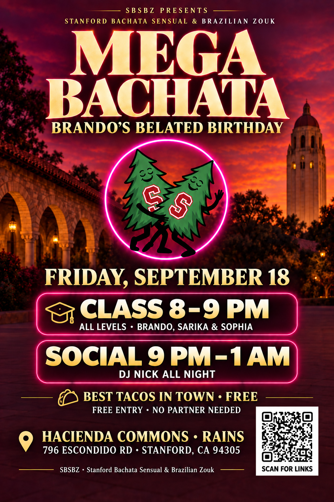

# Complete review — MEGA BACHATA, September 18, 2026

**TLDR:** Review every guest-facing item below. Nothing has been sent; Brando will send the email and WhatsApp himself. Live Partiful refinements and the Linktree correction remain pending final approval.

## Version 7 layout preview — CODE REPAIR PENDING

[Open the latest preview in Drive](https://drive.google.com/file/d/1ERJllbP5QWmxrBEQK9RvM28TXh9ALEQm/view).

[Retained version-5 review artwork](https://drive.google.com/file/d/1Dx2AYe_2WQAmvIlBdnMVky1PQYuPXgEv/view). This is the prior review image; the latest layout preview below is not ready for distribution.

The clean layout and restored small class/taco icons are ready, but the code in the layout preview fails scanning. Do not distribute it. A standalone verified Linktree code is saved as assets/linktree_qr.png; permission to insert it with exact local compositing is pending. The version-5 Drive artwork remains unchanged until the revised final image passes the scan check.



## Event facts and exact destinations

| Item | Final-review value |
|---|---|
| Date | Friday, September 18, 2026 |
| Class | 8–9 PM with Brando, Sarika & Sophia; all levels |
| Social | Friday 9 PM–Saturday 1 AM; DJ Nick all night |
| Venue | Hacienda Commons at Rains |
| Address | 796 Escondido Rd, Stanford, CA 94305 |
| Map | https://maps.app.goo.gl/NgcWLjxzMZJz7XQg8 |
| Admission | FREE |
| Food | Tacos by Chuy, expected around 10 PM |
| Existing Partiful | https://partiful.com/e/ohtSD9MnHe6u71JQx60X |
| Website | https://brando90.github.io/sbsbz/ |
| Linktree | https://linktr.ee/ultimate_brando9 |
| Email sender | Brando Miranda <brandojazz@gmail.com> |
| Email recipient | stanford_bachata_zouk@lists.stanford.edu |
| Email copy recipient | brando.science@gmail.com |
| WhatsApp target | Stanford Bachata Sensual & Brazilian Zouk (SBSBZ), approximately 600 members |
| Sending mode | Brando sends manually; no automatic sends |

## WhatsApp — exact message

After code repair and final approval, attach the approved tree flyer and use this message:

```text
🎉 *MEGA BACHATA — my belated birthday party!*

It’s my second-to-last social before graduating, and I’d love to dance with you! 💃

*Friday, September 18 · FREE ENTRY*
🕗 All-levels class with *Brando, Sarika & Sophia*: *8–9 PM*
🔥 Social: *9 PM–1 AM* with DJ Nick all night
🌮 Tacos by Chuy around 10 PM—my pick for *BEST TACOS IN THE BAY*. Approved by your resident Mexican, Brando 🇲🇽

📍 *Hacienda Commons at Rains*
796 Escondido Rd, Stanford, CA 94305
🗺 Map: https://maps.app.goo.gl/NgcWLjxzMZJz7XQg8

No partner needed—all levels welcome. Bring your friends!

Join us: https://partiful.com/e/ohtSD9MnHe6u71JQx60X
Website: https://brando90.github.io/sbsbz/
Linktree: https://linktr.ee/ultimate_brando9
— Brando
Stanford Bachata Sensual & Brazilian Zouk (SBSBZ)
```

## Email — exact subject and body

Subject: FREE MEGA BACHATA 🎉 Brando’s birthday social · Friday, September 18

Attachment: final approved tree flyer, pending code repair and a successful scan. The portable unsent email still carries version 5 and needs its attachment refreshed before manual sending.

```text
Hi everyone!

I’m celebrating my belated birthday with a MEGA BACHATA night, and you’re invited! This is my second-to-last social before graduating, so I’d love to see familiar faces and meet new ones on the dance floor.

Join Stanford Bachata Sensual & Brazilian Zouk (SBSBZ) on Friday, September 18, 2026:

• 8–9 PM: All-levels class with Brando, Sarika & Sophia
• 9 PM–1 AM: Social dancing and party with DJ Nick all night
• Around 10 PM: Tacos by Chuy—my pick for BEST TACOS IN THE BAY. Approved by your resident Mexican, Brando 🇲🇽🌮
• Admission: FREE

Hacienda Commons at Rains
796 Escondido Rd, Stanford, CA 94305
Map and directions: https://maps.app.goo.gl/NgcWLjxzMZJz7XQg8

No partner needed—all levels welcome. Come solo, bring friends, and celebrate with us!

Join us: https://partiful.com/e/ohtSD9MnHe6u71JQx60X
Website: https://brando90.github.io/sbsbz/
Linktree: https://linktr.ee/ultimate_brando9

See you on the dance floor,
Brando

-----
Brando Miranda
Ph.D. Student
Computer Science, Stanford University
EDGE Scholar, Stanford University
brando9@stanford.edu
website: https://brando90.github.io/brandomiranda/
```

## Partiful — exact description

Title: MEGA BACHATA — Brando’s Belated Birthday
Start: September 18, 2026, 8:00 PM. End: September 19, 2026, 1:00 AM. Timezone: America/Los_Angeles.
Location field: Hacienda Commons at Rains, 796 Escondido Rd, Stanford, CA 94305.
Cover: final approved tree flyer, pending code repair and a successful scan. Keep existing privacy settings. Do not create a duplicate event or send invitations.

```text
A belated birthday. A big bachata night. One more dance before graduation. 💃🎉

Come celebrate my belated birthday with Stanford Bachata Sensual & Brazilian Zouk (SBSBZ)! This is my second-to-last social before I graduate, and I’d love to share the dance floor with you.

FRIDAY, SEPTEMBER 18, 2026
📍 Hacienda Commons at Rains
796 Escondido Rd, Stanford, CA 94305
🗺 Map and directions: https://maps.app.goo.gl/NgcWLjxzMZJz7XQg8
🎟 FREE ENTRY

8–9 PM — ALL-LEVELS CLASS
Start the night together with Brando, Sarika & Sophia!

9 PM–1 AM — SOCIAL / PARTY
DJ Nick is with us for the whole night. Come dance, catch up with friends, and celebrate!

🌮 TACOS BY CHUY — AROUND 10 PM
My pick for BEST TACOS IN THE BAY. Approved by your resident Mexican, Brando 🇲🇽

No partner needed. All levels welcome—come solo or bring friends!

Save your spot and help me make this a birthday to remember. See you on the dance floor!
— Brando

Website: https://brando90.github.io/sbsbz/
Linktree: https://linktr.ee/ultimate_brando9
```

## Live-page changes awaiting approval

- Existing Partiful: replace the location placeholder with the confirmed venue/address/map; apply the above description, which adds the taco endorsement, working website and Linktree; replace the existing version-4 tree cover with the final verified and approved flyer. No invitations or text blasts.
- Linktree: change only the existing club-website button’s destination from https://sbsbz-dance.manus.space/ to https://brando90.github.io/sbsbz/ . Keep its title, order and other links. The editor currently requires account-owner sign-in.

## Saved reuse and execution prompts

Use [the event-specific Manus prompt](https://drive.google.com/file/d/15QI7vES0_1Lc1L85jE2sJcT5yG2_Z_cu/view) for this event. The reusable prompt is also saved at the club Drive root: https://drive.google.com/file/d/1oKks-1m3EpuqhS7z87ekyq7dV2wi05Ek/view . Both default to preparation only and require approval before live edits; messages remain manual.

Address evidence: [Stanford’s Rains Hacienda map listing](https://vienneseball.stanford.edu/austria-fortnight), corroborated by [Waze’s named-place address](https://www.waze.com/live-map/directions/us/ca/stanford/rains,-hacienda-commons?to=place.ChIJTXKWqdy6j4ARfWdQmU-kWAY). The taco superlative is Brando’s personal endorsement.
