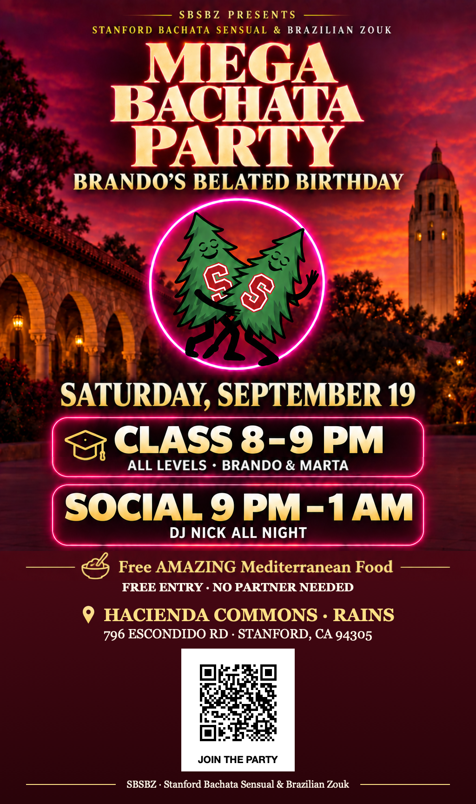

# Complete review — MEGA BACHATA PARTY, September 19, 2026

**TLDR:** The version-14 Mediterranean flyer is saved and its event code is verified. The website and Partiful description say “Free AMAZING Mediterranean Food”; Partiful still shows version 13 because Chrome denied the cover upload. Messages remain unsent.

## Current flyer — version 14, verified event code

[Open or download the current flyer](https://drive.google.com/file/d/13QgipFRjh24jnm8f7L5MU93Z7BRd6XRV/view).

The class and food icons are restored, the food, venue, address and code share one centerline, with equal divider lengths, gaps and margins, and the code labelled JOIN THE PARTY opens the existing Partiful event. Native scanning passed at image widths 1024, 768 and 512 pixels. Linktree stays in the text messages and live Partiful description. The full birthday title, location and updated description are live on Partiful; the version-14 cover upload is pending Chrome file-upload access. Automatic sending is not authorized.



## Event facts and exact destinations

| Item | Final-review value |
|---|---|
| Date | Saturday, September 19, 2026 |
| Class | 8–9 PM with Brando & Marta; all levels |
| Social | Saturday 9 PM–Sunday 1 AM; DJ Nick all night |
| Venue | Hacienda Commons at Rains |
| Address | 796 Escondido Rd, Stanford, CA 94305 |
| Map | https://maps.app.goo.gl/NgcWLjxzMZJz7XQg8 |
| Admission | FREE |
| Food | Free AMAZING Mediterranean Food |
| Existing Partiful | https://partiful.com/e/ohtSD9MnHe6u71JQx60X |
| Website | https://brando90.github.io/sbsbz/ |
| Linktree | https://linktr.ee/ultimate_brando9 |
| Email sender | Brando Miranda <brandojazz@gmail.com> |
| Email recipient | stanford_bachata_zouk@lists.stanford.edu |
| Email copy recipient | brando.science@gmail.com |
| WhatsApp target | Stanford Bachata Sensual & Brazilian Zouk (SBSBZ), approximately 600 members |
| Sending mode | Brando sends manually; no automatic sends |

## WhatsApp — exact message

After final approval, attach the approved tree flyer and use this message:

```text
🎉 *MEGA BACHATA PARTY — my belated birthday!*

It’s my second-to-last social before graduating, and I’d love to dance with you! 💃

*Saturday, September 19 · FREE ENTRY*
🕗 All-levels class with *Brando & Marta*: *8–9 PM*
🔥 Social: *9 PM–1 AM* with DJ Nick all night
🍽 Free AMAZING Mediterranean Food

📍 *Hacienda Commons at Rains*
796 Escondido Rd, Stanford, CA 94305
🗺 Map: https://maps.app.goo.gl/NgcWLjxzMZJz7XQg8

No partner needed—all levels welcome. Bring your friends and feel free to forward this invite!

Join us: https://partiful.com/e/ohtSD9MnHe6u71JQx60X
Website: https://brando90.github.io/sbsbz/
Linktree: https://linktr.ee/ultimate_brando9
— Brando
Stanford Bachata Sensual & Brazilian Zouk (SBSBZ)
```

## Email — exact subject and body

Subject: FREE MEGA BACHATA PARTY 🎉 Brando’s birthday social · Saturday, September 19

Attachment: version-14 tree flyer with verified Partiful code. The portable unsent email contains this exact image; sending awaits final approval.

```text
Hi everyone!

I’m celebrating my belated birthday with a MEGA BACHATA PARTY, and you’re invited! This is my second-to-last social before graduating, so I’d love to see familiar faces and meet new ones on the dance floor.

Join Stanford Bachata Sensual & Brazilian Zouk (SBSBZ) on Saturday, September 19, 2026:

• 8–9 PM: All-levels class with Brando & Marta
• 9 PM–1 AM: Social dancing and party with DJ Nick all night
• Free AMAZING Mediterranean Food
• Admission: FREE

Hacienda Commons at Rains
796 Escondido Rd, Stanford, CA 94305
Map and directions: https://maps.app.goo.gl/NgcWLjxzMZJz7XQg8

No partner needed—all levels welcome. Come solo, bring friends, and celebrate with us! Please feel free to forward this invitation.

Join us: https://partiful.com/e/ohtSD9MnHe6u71JQx60X
Website: https://brando90.github.io/sbsbz/
Linktree: https://linktr.ee/ultimate_brando9

See you on the dance floor,
Brando

-----
Brando Miranda
Ph.D. Student
Computer Science, Stanford University
EDGE Scholar, Stanford University
brando9@stanford.edu
website: https://brando90.github.io/brandomiranda/
```

## Slack and Discord — manual-post drafts

Copy the platform-formatted message from [slack.md](https://drive.google.com/file/d/1JVelbD2i8x4xXdo7dW1DpafXgcgDpZO0/view) or [discord.md](https://drive.google.com/file/d/1XiSZiw8_n73ksUs8kIfsTJPXGkrIKfeT/view) after final approval. Both include the confirmed event facts, map, website, Linktree and existing Partiful link. Brando selects the destination channel and posts himself; neither message has been sent.

## Partiful — exact description

Title: MEGA BACHATA PARTY — Brando’s Belated Birthday
Start: September 19, 2026, 8:00 PM. End: September 20, 2026, 1:00 AM. Timezone: America/Los_Angeles.
Location field: Hacienda Commons at Rains, 796 Escondido Rd, Stanford, CA 94305.
Current live cover: version-13 tree flyer. Replacement version 14 is verified and ready; Chrome denied its upload. Keep existing privacy settings. Do not create a duplicate event or send invitations.

```text
A belated birthday. A big bachata night. One more dance before graduation. 💃🎉

Come celebrate my belated birthday with Stanford Bachata Sensual & Brazilian Zouk (SBSBZ)! This is my second-to-last social before I graduate, and I’d love to share the dance floor with you.

SATURDAY, SEPTEMBER 19, 2026
📍 Hacienda Commons at Rains
796 Escondido Rd, Stanford, CA 94305
🗺 Map and directions: https://maps.app.goo.gl/NgcWLjxzMZJz7XQg8
🎟 FREE ENTRY

8–9 PM — ALL-LEVELS CLASS
Start the night together with Brando & Marta!

9 PM–1 AM — SOCIAL / PARTY
DJ Nick is with us for the whole night. Come dance, catch up with friends, and celebrate!

🍽 Free AMAZING Mediterranean Food

No partner needed. All levels welcome—come solo or bring friends!

Save your spot and help me make this a birthday to remember. See you on the dance floor!
— Brando

Website: https://brando90.github.io/sbsbz/
Linktree: https://linktr.ee/ultimate_brando9
```

## Slack — exact message

```text
🎉 *MEGA BACHATA PARTY — my belated birthday!*

It’s my second-to-last social before graduating, and I’d love to dance with you! 💃

*Saturday, September 19, 2026 · FREE ENTRY*
🕗 All-levels class with *Brando & Marta*: *8–9 PM*
🔥 Social: *9 PM–1 AM* with DJ Nick all night
🍽 Free AMAZING Mediterranean Food

📍 *Hacienda Commons at Rains*
796 Escondido Rd, Stanford, CA 94305
🗺 Map: https://maps.app.goo.gl/NgcWLjxzMZJz7XQg8

No partner needed—all levels welcome. Bring your friends and feel free to forward this invite!

Join us: https://partiful.com/e/ohtSD9MnHe6u71JQx60X
Website: https://brando90.github.io/sbsbz/
Linktree: https://linktr.ee/ultimate_brando9
— Brando
Stanford Bachata Sensual & Brazilian Zouk (SBSBZ)
```

## Discord — exact message

```text
🎉 **MEGA BACHATA PARTY — my belated birthday!**

It’s my second-to-last social before graduating, and I’d love to dance with you! 💃

**Saturday, September 19, 2026 · FREE ENTRY**
🕗 All-levels class with **Brando & Marta**: **8–9 PM**
🔥 Social: **9 PM–1 AM** with DJ Nick all night
🍽 Free AMAZING Mediterranean Food

📍 **Hacienda Commons at Rains**
796 Escondido Rd, Stanford, CA 94305
🗺 Map: https://maps.app.goo.gl/NgcWLjxzMZJz7XQg8

No partner needed—all levels welcome. Bring your friends and feel free to forward this invite!

Join us: https://partiful.com/e/ohtSD9MnHe6u71JQx60X
Website: https://brando90.github.io/sbsbz/
Linktree: https://linktr.ee/ultimate_brando9
— Brando
Stanford Bachata Sensual & Brazilian Zouk (SBSBZ)
```

## Live-page status

- Existing Partiful: the full birthday title, Hacienda Commons at Rains location/address, map and exact description above are saved and verified, including the updated food wording, working website, Linktree and updated instructor credit. The version-14 cover upload is blocked by Chrome file-upload access; the old version-13 cover remains live. No invitations or text blasts were sent.
- Linktree, separately pending approval: change only the existing club-website button’s destination from https://sbsbz-dance.manus.space/ to https://brando90.github.io/sbsbz/ . Keep its title, order and other links. The editor currently requires account-owner sign-in.

## Saved reuse and execution prompts

Use [the event-specific Manus prompt](https://drive.google.com/file/d/15QI7vES0_1Lc1L85jE2sJcT5yG2_Z_cu/view) for this event. The reusable prompt is also saved at the club Drive root: https://drive.google.com/file/d/1oKks-1m3EpuqhS7z87ekyq7dV2wi05Ek/view . The event-specific prompt records the completed text update and blocked cover upload; both prompts keep messages manual.

Address evidence: [Stanford’s Rains Hacienda map listing](https://vienneseball.stanford.edu/austria-fortnight), corroborated by [Waze’s named-place address](https://www.waze.com/live-map/directions/us/ca/stanford/rains,-hacienda-commons?to=place.ChIJTXKWqdy6j4ARfWdQmU-kWAY).
